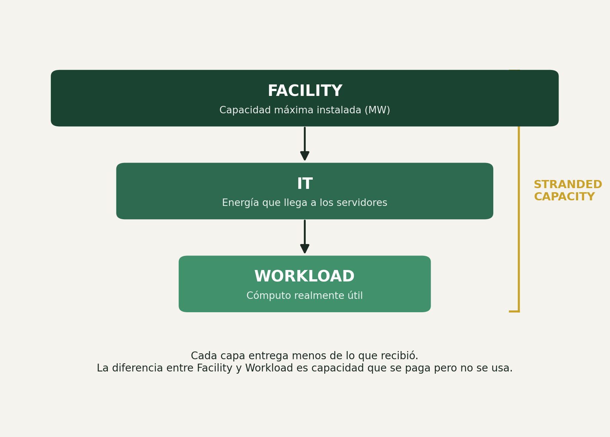

# PhysaFlow — Calculadora de Stranded Capacity

*Lógica de cálculo y las 3 capas del sistema*

Este documento resume, en lenguaje simple, cómo se calcula la capacidad desperdiciada (stranded capacity) de un data center y cómo se relacionan las tres capas del sistema: facility, IT y workload. Sirve como insumo para diseño (para poner números reales en los mockups) y como base para quien luego implemente la calculadora.

---

## 1. Las tres capas, explicadas simple

Un data center puede pensarse como tres filtros apilados, cada uno más chico que el anterior. En cada paso se pierde algo de capacidad, y esa pérdida acumulada es la que la calculadora traduce en dólares por año.

**Facility → IT → Workload**



Cada capa entrega menos de lo que recibió de la anterior. La diferencia entre Facility y Workload es capacidad que se paga pero no se usa.

| Capa | Qué es | En palabras simples |
|---|---|---|
| Facility | Energía y cooling máximos que el edificio puede entregar | El techo teórico. Se mide en MW. |
| IT | Energía que efectivamente llega a los servidores | Siempre se pierde algo en el camino: redundancia y márgenes de seguridad. |
| Workload | Cómputo realmente útil que se ejecuta | Muchos servidores están encendidos pero subutilizados. |

**Stranded capacity** = la diferencia entre lo que el facility podría dar y lo que el workload realmente usa. Es capacidad que se paga (energía, refrigeración, mantenimiento) pero que no genera valor.

## 2. Cálculos generales de la calculadora

### 2.1 Inputs y outputs

Estos son los datos que entran (Momento 1) y los que salen (Momento 2 y 3):

| Campo | Tipo | Ejemplo |
|---|---|---|
| facility_mw | Número, MW del facility | 5.0 |
| utilizacion_pct | Número, 0 a 100 | 60 |
| cooling_type | aire \| líquido \| inmersión | aire |
| stranded_pct (output) | Número, % | 22.3 |
| stranded_mw (output) | Número, MW | 1.12 |
| costo_anual_min / max (output) | Rango en USD | $180.000 – $246.000 |

### 2.2 Margen de seguridad según tipo de cooling

Cada tipo de refrigeración necesita reservar un margen distinto de capacidad como colchón de seguridad (esto es lo que explica buena parte de la pérdida entre Facility e IT):

| Tipo de cooling | Margen de seguridad | Por qué |
|---|---|---|
| Aire | 15% | Menos eficiente, necesita más redundancia |
| Líquido | 8% | Mejor disipación, menos margen requerido |
| Inmersión | 5% | Más eficiente, mínimo margen necesario |

### 2.3 Fórmula paso a paso

```
capacidad_utilizable = facility_mw × (1 − margen_seguridad)
stranded_mw = capacidad_utilizable − (facility_mw × utilizacion_pct / 100)
stranded_pct = stranded_mw / facility_mw × 100

costo_anual_min = stranded_mw × 400.000
costo_anual_max = stranded_mw × 550.000
```

> El rango de 400.000 a 550.000 USD por MW/año es un valor estimado de referencia; el equipo puede ajustarlo si encuentra una fuente más precisa para el sector.

### 2.4 Ejemplo calculado

| Input | Valor |
|---|---|
| Facility | 5 MW |
| Utilización | 60% |
| Cooling | Aire (margen 15%) |
| → Capacidad utilizable | 4.25 MW |
| → Stranded MW | 1.25 MW |
| → Stranded % | 25% |
| → Costo anual estimado | $500.000 – $687.500 |

### 2.5 Casos límite a definir con el equipo

- Si utilización es 100%, ¿stranded_mw puede dar negativo? Se recomienda clampear el resultado a 0.
- ¿Hay un tamaño mínimo de facility (en MW) por debajo del cual el cálculo deja de tener sentido?
- ¿El margen de seguridad varía también según el tamaño del facility, o es fijo por tipo de cooling?

---

*Documento de trabajo interno — equipo No Country, desafío PhysaFlow / Stranded Capacity Calculator.*
