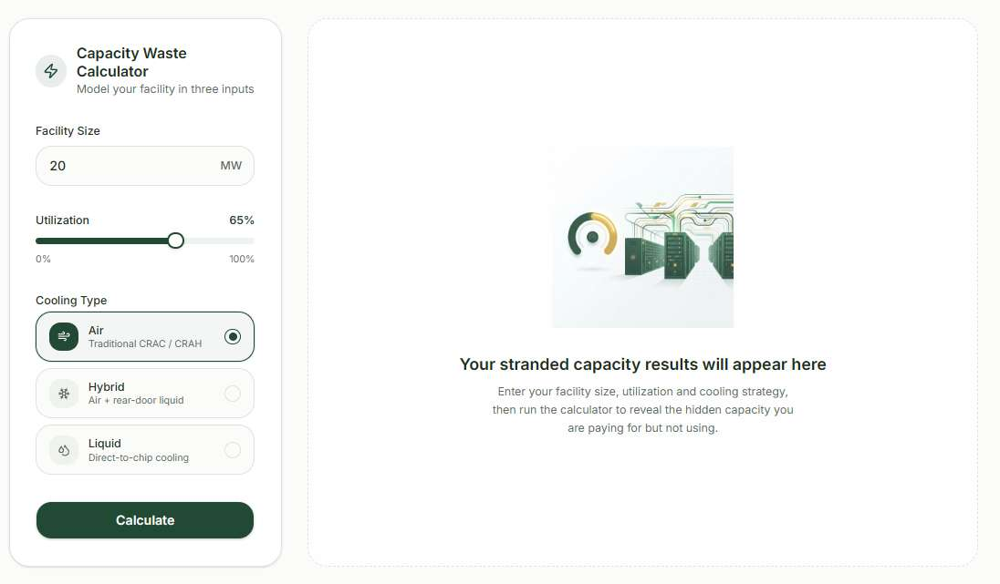
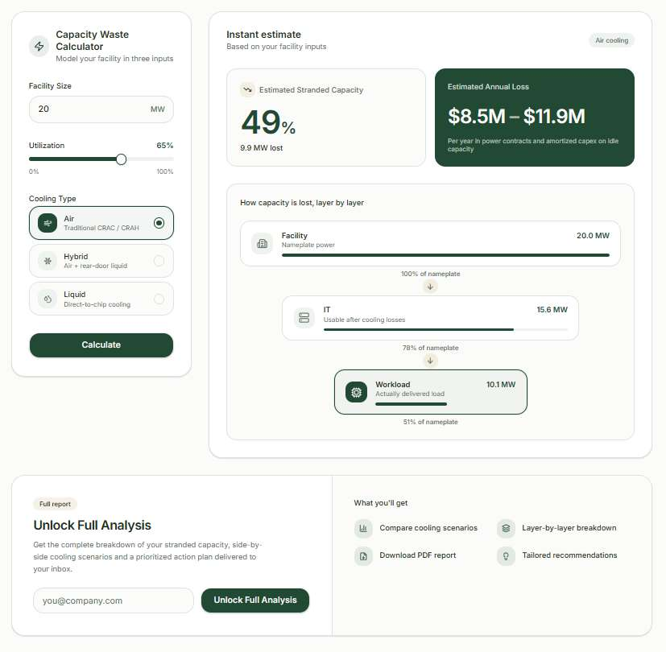
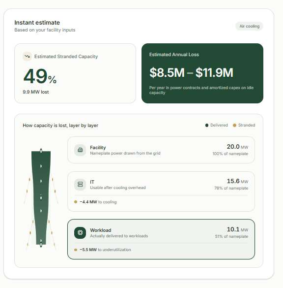
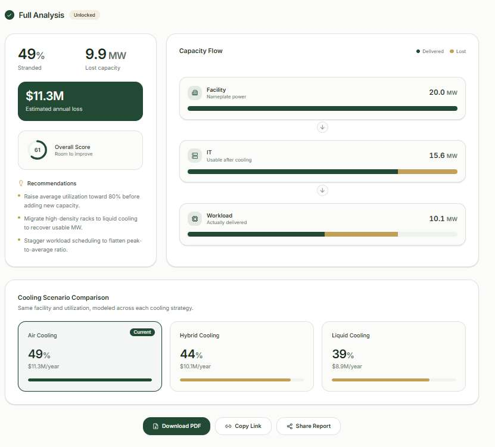
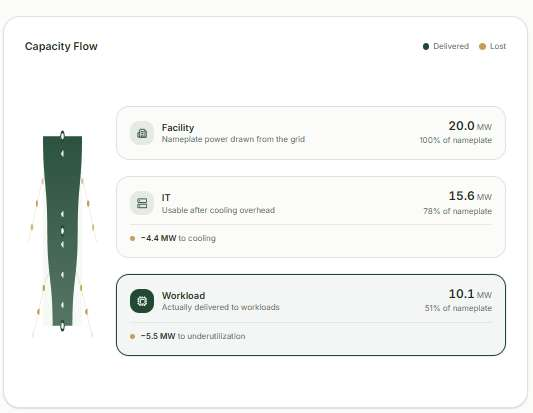

# Capturas y exploraciones

Registro de las distintas exploraciones visuales realizadas durante el proceso de diseño de la Stranded Capacity Calculator. Este material reúne capturas y propuestas utilizadas para explorar diferentes formas de representar la información y construir la experiencia final de la calculadora.

---

## 1. Momento 1 — Estado inicial (inputs)

**Capacity Waste Calculator — "Model your facility in three inputs"**

Pantalla de entrada de datos, con tres campos:

- **Facility Size:** input numérico en MW (ejemplo: 20 MW).
- **Utilization:** slider de 0% a 100% (ejemplo: 65%).
- **Cooling Type:** selector de tarjetas con ícono, título y descripción corta:
  - Air — *Traditional CRAC / CRAH*
  - Hybrid — *Air + rear-door liquid*
  - Liquid — *Direct-to-chip cooling*

Botón principal **"Calculate"** al pie del formulario.

Del lado derecho, el panel de resultados aparece vacío con un mensaje placeholder: *"Your stranded capacity results will appear here"*, invitando a completar los tres inputs y ejecutar el cálculo.

## 2. Momento 2 — Resultado instantáneo (instant estimate)

Con los inputs cargados (Facility 20 MW, Utilización 65%, Air cooling), el panel derecho muestra:

- **Estimated Stranded Capacity:** número grande en % (ejemplo: 49%, "9.9 MW lost").
- **Estimated Annual Loss:** tarjeta destacada en verde oscuro con el rango de pérdida financiera anual (ejemplo: $8.5M – $11.9M), con la aclaración *"Per year in power contracts and amortized capex on idle capacity"*.
- **How capacity is lost, layer by layer:** tres tarjetas apiladas (Facility → IT → Workload), cada una con su ícono, el valor en MW y el % respecto al nameplate original.

Debajo, una sección de conversión (**"Unlock Full Analysis"**) invita a dejar un email para acceder al reporte completo, listando qué incluye: comparación de escenarios de cooling, breakdown capa por capa, reporte descargable en PDF y recomendaciones personalizadas.

## 3. Detalle — Capacity Flow (breakdown por capa)

Versión ampliada del breakdown de capas, con una barra vertical tipo "embudo" a la izquierda que se va angostando, y a la derecha tres tarjetas con más detalle:

- **Facility** — Nameplate power drawn from the grid — 20.0 MW (100% of nameplate).
- **IT** — Usable after cooling overhead — 15.6 MW (78% of nameplate), con el detalle de la pérdida: *"-4.4 MW to cooling"*.
- **Workload** — Actually delivered to workloads — 10.1 MW (51% of nameplate), con el detalle de la pérdida: *"-5.5 MW to underutilization"*.

Leyenda de color: **Delivered** (verde oscuro) vs. **Stranded** (dorado), usada de forma consistente en toda la calculadora.

## 4. Momento 3 — Full Analysis (desbloqueado)

Vista completa del reporte, una vez ingresado el email:

- Encabezado con badge **"Full Analysis — Unlocked"**.
- Bloque de métricas principales: 49% Stranded, 9.9 MW Lost capacity, $11.3M Estimated annual loss, y un **Overall Score** circular (61 — "Room to improve").
- Lista de **Recommendations**, en formato de bullets accionables:
  - Raise average utilization toward 80% before adding new capacity.
  - Migrate high-density racks to liquid cooling to recover usable MW.
  - Stagger workload scheduling to flatten peak-to-average ratio.
- **Capacity Flow** repetido (mismo diagrama de embudo que en el punto 3), ahora dentro del reporte completo:

- **Cooling Scenario Comparison:** tres tarjetas lado a lado (Air / Hybrid / Liquid) mostrando el % stranded y la pérdida anual de cada escenario, con la opción actual (Air) marcada con badge **"Current"**.
- Acciones al pie: **Download PDF**, **Copy Link**, **Share Report**.

## 5. Qué muestran estas capturas en conjunto

- La progresión de tres momentos del producto: **inputs → resultado instantáneo → análisis completo**, coincide con la estructura Facility → IT → Workload documentada en los archivos 02 y 03.
- El uso consistente del par de colores **verde (delivered) / dorado (stranded)** en todas las vistas, que también aparece en las opciones gráficas exploradas en el archivo 06.
- El mecanismo de conversión (email a cambio de reporte completo) como parte del flujo de producto, no solo como pantalla de resultados.
- Estas capturas fueron la referencia visual usada para construir el diseño final del proyecto en Figma.

> **Nota:** estas imágenes se extrajeron directamente de las capturas originales incluidas en el PDF de referencia (`Vistas.pdf`).

---

*Documento de exploración visual — equipo No Country, desafío PhysaFlow / Stranded Capacity Calculator.*
