# Opciones Gráficas para la Calculadora

*Exploración de visualizaciones para el resultado final y los datos de referencia — julio 2026*

Este documento explora distintas formas de graficar dos cosas: los datos que la calculadora tiene que mostrarle al operador en su etapa final (Momento 2 y 3 del challenge), y los datos ya procesados en el documento de parámetros de referencia. Cada bloque muestra 2 o más opciones reales, armadas con los números que ya calculamos, con una breve nota de cómo leer cada gráfico para que diseño elija con criterio.

---

## Parte A — Datos de la etapa final del proyecto

Estos son los gráficos para lo que el operador ve directamente en la calculadora: stranded % y MW, pérdida financiera, breakdown por capa, comparación de escenarios y el resultado compartible.

### A.1 — Stranded Capacity (%)

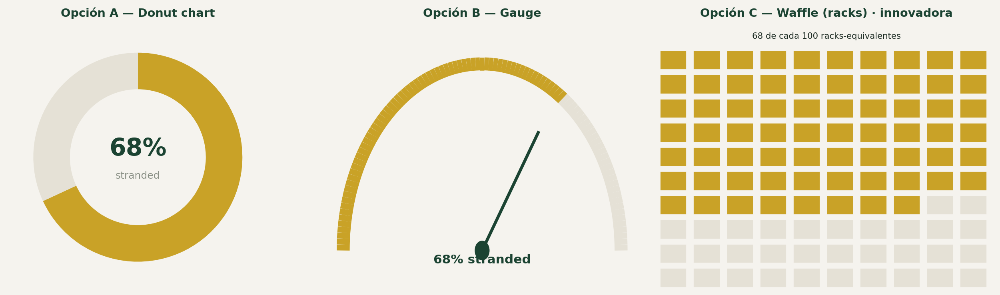

Tres opciones exploradas: **Donut chart**, **Gauge** y **Waffle (racks)**.

*Cómo se lee:* el número grande es el % de capacidad desperdiciada; en el gauge, la aguja apunta más a la derecha cuanto peor es el resultado.

El donut es más flexible para layout (cabe en cualquier tarjeta) y es el más reconocible. El gauge comunica mejor la idea de "medidor" y refuerza la sensación de urgencia cuando el número es alto, pero ocupa más espacio vertical. **Recomendamos el donut para el Momento 2.**

### A.1b — Stranded Capacity (MW, valor absoluto)

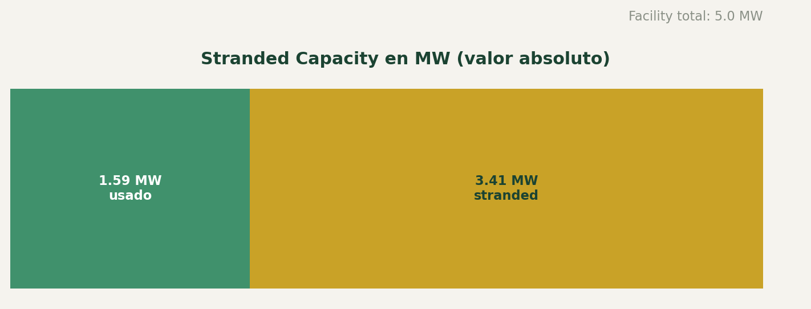

Barra de dos segmentos: facility total dividido en usado (verde) vs. stranded (dorado).

*Cómo se lee:* la barra completa es el facility total; la parte verde es lo que se usa hoy, la parte dorada es lo que se desperdicia — visualmente muestra la proporción real, no solo el porcentaje.

El % por sí solo no dice si el operador tiene un facility chico o gigante. Mostrar el MW absoluto en una barra de dos segmentos (usado vs. stranded) da contexto de escala sin agregar otro número suelto — sirve como complemento del gráfico A.1, no como reemplazo.

### A.2 — Pérdida financiera anual (rango)

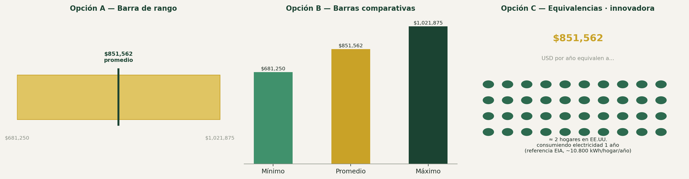

Tres opciones: **Barra de rango**, **Barras comparativas** y **Equivalencias**.

*Cómo se lee:* en la barra de rango, la línea vertical marca el promedio dentro del rango mínimo-máximo; en las barras comparativas, cada barra es uno de los tres valores por separado.

La barra de rango comunica de un vistazo que es una estimación (no un número exacto). Las barras comparativas son más legibles para leer los tres valores exactos. **Recomendamos la barra de rango para el resultado básico, y las barras comparativas para el detalle en Momento 3.**

### A.3 — Breakdown por capas (la pieza más importante)

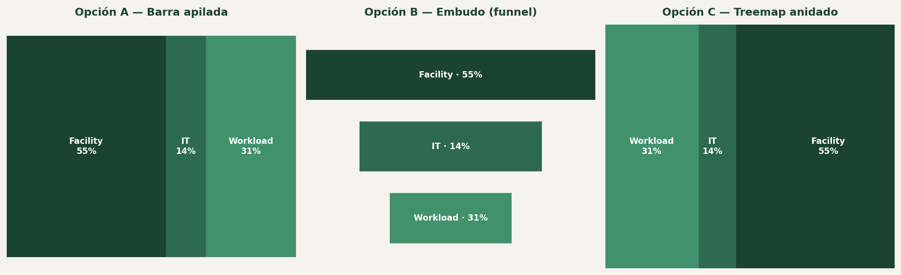

Tres opciones: **Barra apilada**, **Embudo (funnel)** y **Treemap anidado**.

*Cómo se lee:* en las tres opciones, el tamaño de cada segmento es proporcional al % de pérdida que le corresponde a esa capa — más grande el segmento, más responsable es esa capa del problema.

El embudo comunica mejor la idea de flujo que se va perdiendo capa por capa (coincide con la metáfora Facility → IT → Workload). El treemap es más compacto y funciona bien en espacios chicos. La barra apilada es la más simple pero la menos distintiva.

### A.3b — El mismo breakdown, comparado entre los 4 tipos de cooling

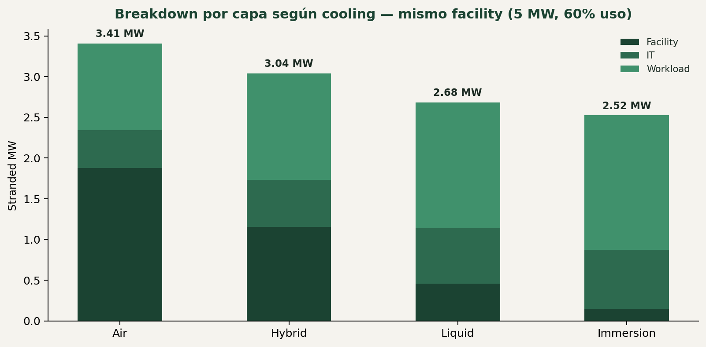

Barras apiladas por tipo de cooling (Air, Hybrid, Liquid, Immersion), mismo facility (5 MW) y misma utilización (60%).

*Cómo se lee:* cada barra es un tipo de cooling distinto; la altura total de la barra es el stranded MW de ese escenario, y los tres colores muestran en qué capa se concentra la pérdida en cada caso.

Este es el gráfico que mejor demuestra el valor del modelo optimizado: con el mismo facility y la misma utilización, cambiar el cooling no solo baja el total, sino que mueve el problema de una capa a otra. **Es un candidato fuerte para Momento 3** (comparación de escenarios).

### A.3c — Opción innovadora: flujo tipo río

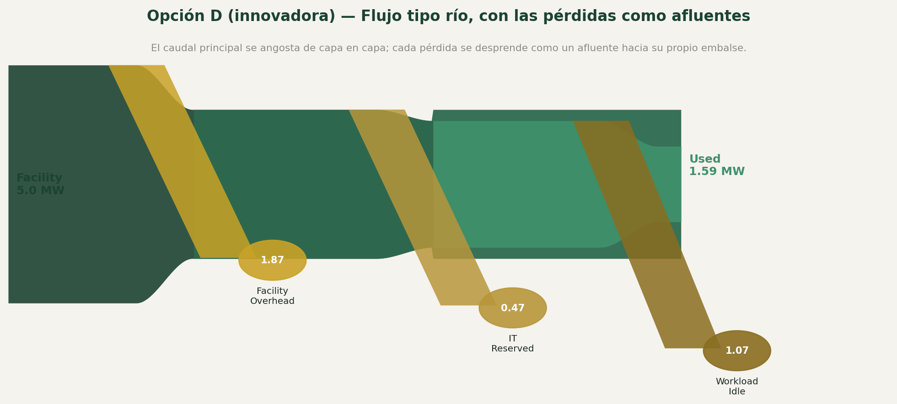

Diagrama tipo Sankey: el caudal principal se angosta capa a capa (Facility → Facility Overhead / IT Reserved / Workload Idle → Used).

*Cómo se lee:* el caudal principal (el río central) se angosta de izquierda a derecha a medida que se pierde capacidad; cada pérdida se desprende como un afluente hacia su propio embalse (círculo), etiquetado con cuántos MW se fueron por ahí.

Esta es la opción más distintiva de las cuatro, y la que más conecta con la identidad de PhysaFlow: su propio producto se llama "Distributed **Flow** Intelligence", así que un diagrama de flujo real (no un gráfico de torta o barras) refuerza la marca en la pieza visual más importante del proyecto. Es más compleja de construir en Figma que las otras tres opciones, pero es la que menos se parece a cualquier dashboard genérico de la competencia — cumple mejor con el pedido del brief de ser "clara, memorable y distinta a cualquier cosa existente en la industria".

### A.4 — Comparación de escenarios

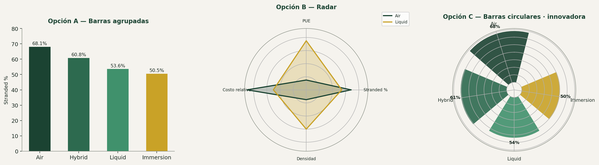

Tres opciones: **Barras agrupadas**, **Radar** y **Barras circulares**.

*Cómo se lee:* en las barras, cada color es un tipo de cooling y la altura es su stranded %; en el radar, cada eje es una métrica distinta y el área que forma cada línea resume el desempeño global de ese escenario — más área "hacia adentro" (cerca del centro) es mejor en Stranded % y Costo.

Las barras agrupadas son mejores cuando solo importa comparar 1-2 métricas. El radar es mejor cuando se quieren comparar varias dimensiones a la vez. Para "comparar escenarios" tal como lo pide el Momento 3, **recomendamos barras agrupadas** — más fácil de entender en 3 minutos.

### A.4b — Recoverable Capacity

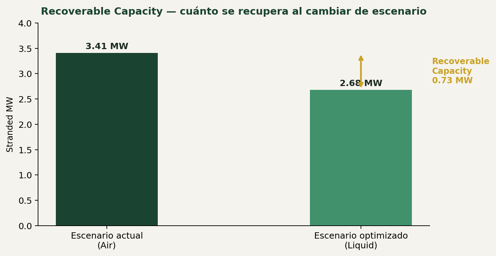

Comparación de barras entre el escenario actual y el optimizado, con una flecha que marca la diferencia recuperable.

*Cómo se lee:* la flecha dorada mide la diferencia entre el escenario actual y el optimizado — ese tramo es literalmente cuánta capacidad se recupera si el operador cambia de cooling.

Este gráfico responde la pregunta que más le importa al operador después de ver el problema: "¿cuánto podría recuperar si actúo?". Es el gráfico que mejor vende la propuesta de valor de PhysaFlow, y encaja bien como cierre de la sección de comparación de escenarios.

### A.5 — Resultado compartible

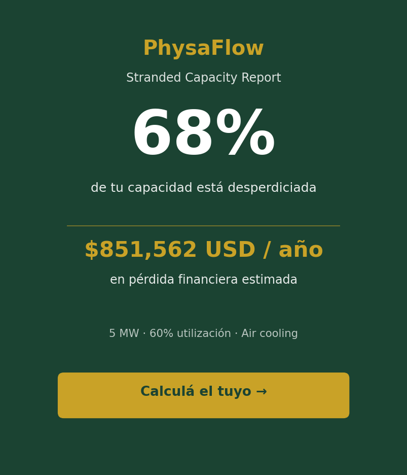

Tarjeta tipo social card, formato 1:1 o 4:5, con el número más impactante en grande (ej. 68% desperdiciado), el dato en dorado con el impacto en dinero (ej. $851,562 USD/año), y un call-to-action.

*Cómo se lee:* pensado para leerse sin contexto: el número grande es lo primero que ve un colega al recibir la imagen, el dato en dorado es el impacto en dinero, y el pie de página muestra con qué configuración se calculó.

Es el tipo de pieza que un operador comparte con un colega sin necesitar contexto adicional.

---

## Parte B — Datos del documento de parámetros de referencia

Estos gráficos son para uso interno del equipo (documentación, presentación, pitch) — muestran los benchmarks que sustentan el modelo, no son parte de la calculadora en sí.

### B.1 — PUE de referencia por tipo de cooling

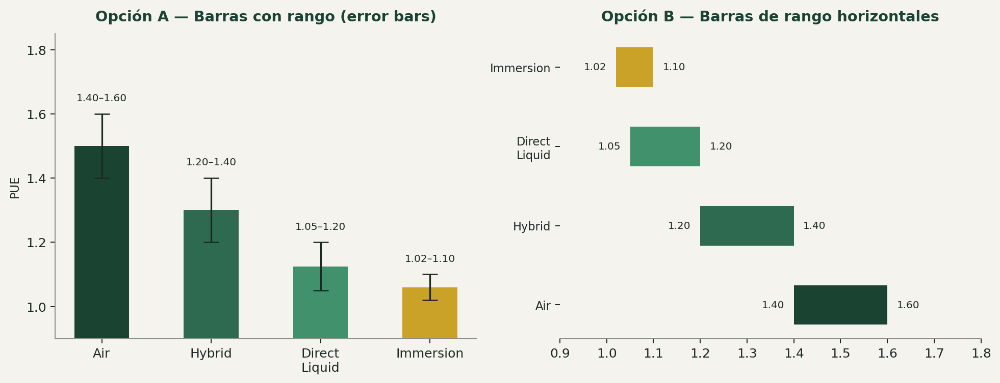

Dos opciones: **Barras con rango (error bars)** y **Barras de rango horizontales**.

*Cómo se lee:* cada barra muestra el rango publicado (no un valor fijo); cuanto más abajo y más angosto el rango, más eficiente y más consistente es esa tecnología de cooling.

Ambas opciones comunican rango, importante porque ningún organismo publica un PUE oficial por tipo de cooling. Las barras horizontales son más legibles para leer extremos exactos.

### B.2 — Densidad soportada por rack (kW/rack)

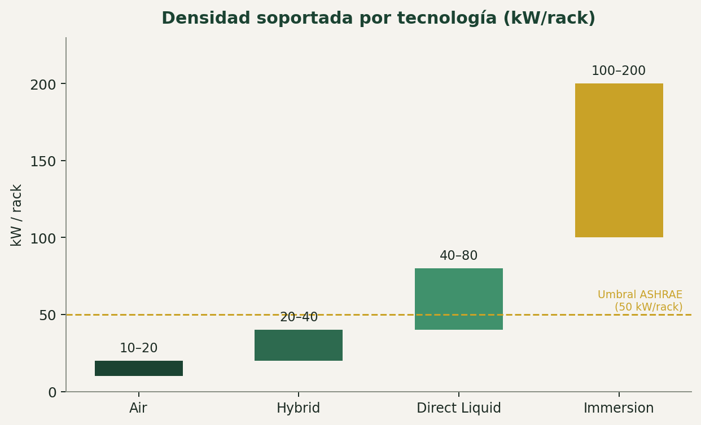

Barras por tecnología (Air, Hybrid, Direct Liquid, Immersion), con una línea punteada marcando el umbral ASHRAE de 50 kW/rack.

*Cómo se lee:* la altura de cada barra es el rango de densidad que soporta cada tecnología; la línea dorada punteada marca el umbral de ASHRAE (50 kW/rack) a partir del cual se recomienda liquid cooling.

Útil si el equipo quiere mostrar en qué punto se recomienda técnicamente migrar de tecnología.

### B.2b — Cooling Energy Share y AI Rack Density

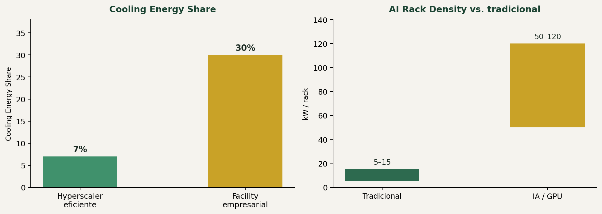

Dos gráficos de barras: % de energía en cooling (hyperscaler eficiente 7% vs. facility empresarial 30%) y densidad de rack (tradicional 5-15 vs. IA/GPU 50-120+ kW/rack).

*Cómo se lee:* a la izquierda, cada barra es qué % de la energía total se va en cooling según qué tan eficiente es el facility; a la derecha, el rango de densidad de rack típico de carga tradicional vs. carga de IA — la diferencia de escala (5-15 vs. 50-120+) es el punto clave.

Estos dos datos son buenos para justificar, en una presentación, por qué las cargas de IA rompen los supuestos clásicos de diseño de data centers.

### B.3 — Precio de electricidad por región

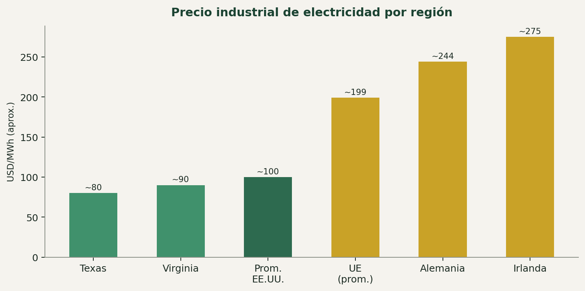

Barras ordenadas de menor a mayor precio industrial aproximado por región (Texas, Virginia, Promedio EE.UU., UE, Alemania, Irlanda), en USD/MWh.

*Cómo se lee:* barras ordenadas de menor a mayor precio industrial aproximado por región, en USD/MWh.

Suficiente para mostrar cuánto puede variar el resultado financiero según la región del operador.

### B.4 — Ahorro relativo por tecnología

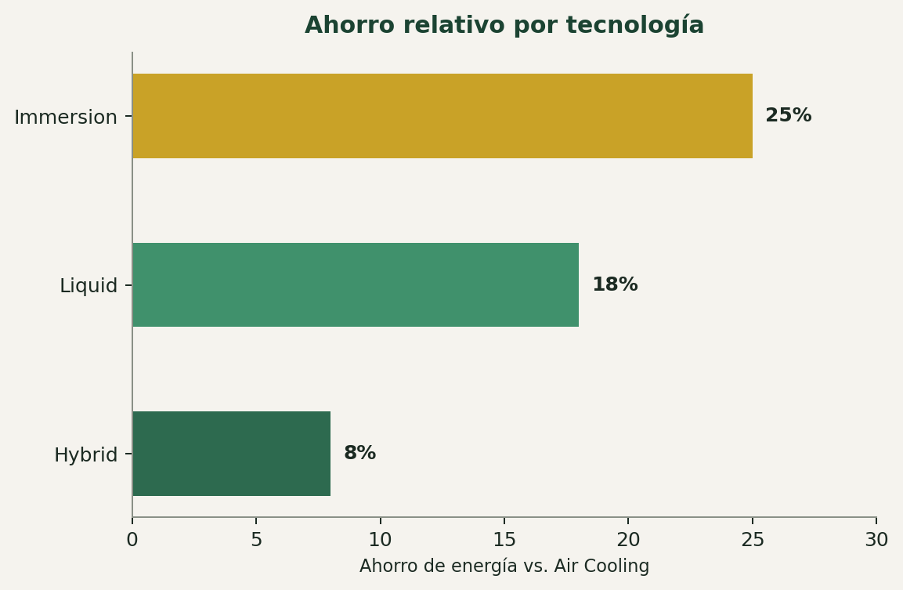

Barras horizontales: Hybrid ≈8%, Liquid ≈18%, Immersion ≈25% de ahorro de energía vs. Air Cooling.

*Cómo se lee:* cada barra es el % de energía que se ahorra frente a Air Cooling al usar esa tecnología.

El orden ascendente refuerza visualmente la progresión de eficiencia entre tecnologías.

### B.5 — Resultados del estudio Vertiv + NVIDIA

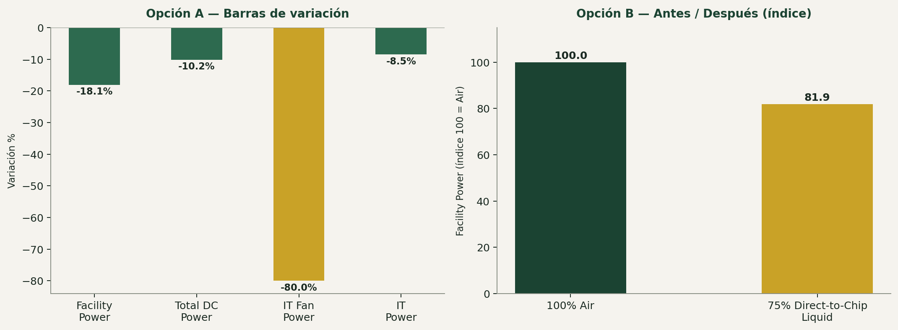

Dos opciones: **Barras de variación** (Facility Power -18.1%, Total DC Power -10.2%, IT Fan Power -80%, IT Power -8.5%) y **Antes/Después indexado** (100% Air = índice 100 → 75% Direct-to-Chip Liquid = índice 81.9).

*Cómo se lee:* en la opción A, cada barra negativa es cuánto bajó esa métrica al migrar de Air a Liquid cooling; en la opción B, se indexa el consumo de Air a 100 para ver la caída de un vistazo.

La opción A es mejor para mostrar varias métricas a la vez. La opción B es más intuitiva para una sola métrica cuando se quiere comunicar "esto bajó de 100 a 82".

### B.5b — Water Usage Improvement

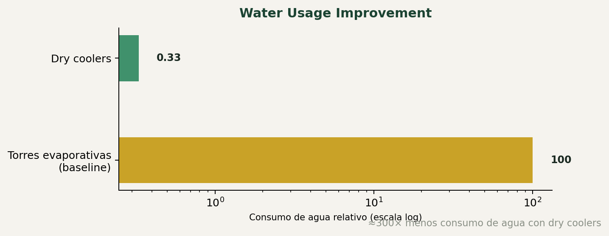

Barras en escala logarítmica: torres evaporativas (baseline, 100) vs. dry coolers (0.33) — ≈300x menos consumo de agua.

*Cómo se lee:* escala logarítmica: la barra dorada (torres evaporativas) es la referencia; la barra verde (dry coolers) es prácticamente invisible de lo chica que es en comparación — ahí está el ~300×.

Dato de sostenibilidad para un pitch, aunque no forma parte del algoritmo base del MVP.

### B.6 — Breakdown del facility: modelo tradicional vs. data center de IA

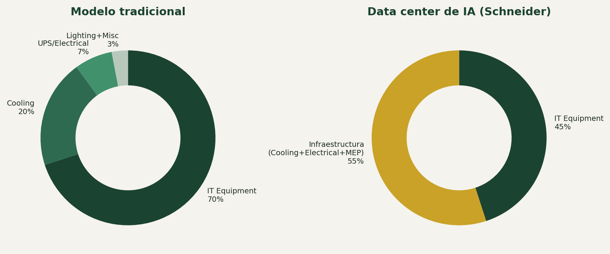

Dos donuts lado a lado: modelo tradicional (IT Equipment 70%, Cooling 20%, UPS/Electrical 7%, Lighting+Misc 3%) vs. data center de IA — Schneider (IT Equipment 45%, Infraestructura 55%).

*Cómo se lee:* dos donuts lado a lado con la misma escala — comparar el tamaño de la porción de "Infraestructura" en cada uno es el punto central: pasa de chica (20%+7%+3%) a dominante (55%).

Buen gráfico para presentación al jurado: contrasta visualmente el hallazgo de que, en IA, la infraestructura le gana peso a IT, al revés de la creencia tradicional.

### B.7 — Evolución del modelo con ITWC

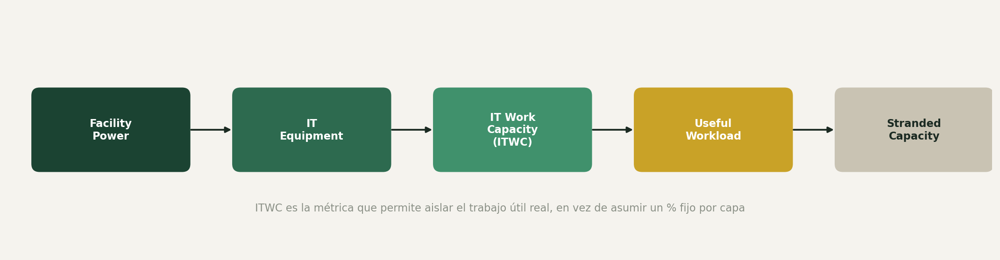

Pipeline horizontal: Facility Power → IT Equipment → IT Work Capacity (ITWC) → Useful Workload → Stranded Capacity.

*Cómo se lee:* se lee de izquierda a derecha como un pipeline: cada caja es una etapa que el modelo atraviesa hasta llegar al trabajo realmente útil (ITWC), con la capacidad stranded como resultado final del proceso, no como una resta aparte.

Este diagrama documenta el hallazgo más importante del documento de parámetros: ITWC es una métrica real que corresponde exactamente a la capa Workload del challenge. Útil para explicarle al equipo por qué el modelo evolucionó de 3 a 5 etapas.

### B.8 — Árbol de decisión de Recommendations

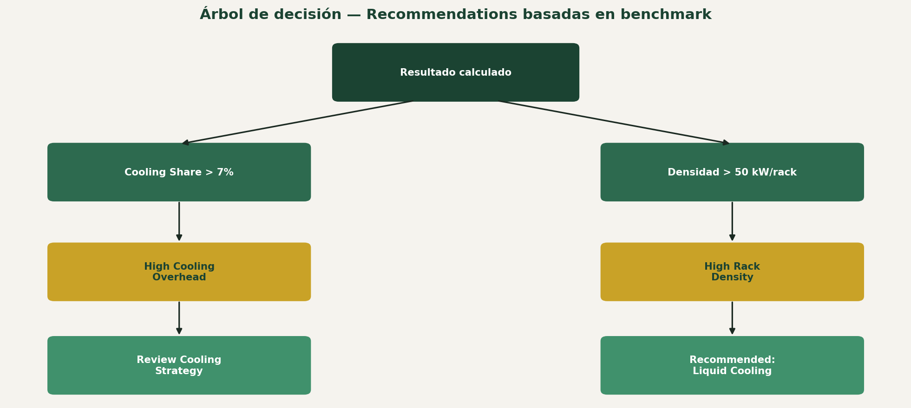

Diagrama de flujo: Resultado calculado → (Cooling Share > 7% → High Cooling Overhead → Review Cooling Strategy) / (Densidad > 50 kW/rack → High Rack Density → Recommended: Liquid Cooling).

*Cómo se lee:* se lee de arriba hacia abajo: el resultado calculado dispara una pregunta binaria en cada rama; si se cumple la condición, se activa la alerta y después la recomendación concreta.

Muestra que las recomendaciones del producto son reglas basadas en benchmarks reales (ASHRAE), no umbrales inventados — útil para defender el diseño frente a preguntas del jurado.

---

## Resumen de recomendaciones

| Dato | Opción recomendada | Por qué |
|---|---|---|
| Stranded % | Donut chart | Compacto, reconocible, flexible en layout |
| Stranded MW | Barra de dos segmentos | Da contexto de escala junto al % |
| Pérdida financiera | Barra de rango | Comunica "estimación", no valor exacto |
| Breakdown por capas | Flujo tipo río (innovadora) | Distintivo, conecta con la marca "Flow Intelligence" de PhysaFlow |
| Breakdown comparado por cooling | Barras apiladas por tipo | Muestra cómo se mueve el problema entre capas |
| Comparación de escenarios | Barras agrupadas | Más fácil de leer en 3 minutos |
| Recoverable Capacity | Barras + flecha de diferencia | Responde "cuánto puedo recuperar" |
| Resultado compartible | Tarjeta tipo social card | Formato nativo para compartir por chat/redes |
| Benchmarks internos (PUE, densidad, precios) | Barras de rango horizontales | Prioriza legibilidad sobre estética |

> **Nota:** todas las imágenes de este documento se extrajeron directamente de las capturas originales incluidas en el PDF de referencia (`Opciones_Graficas.pdf`).

---

*Documento de exploración visual — equipo No Country, desafío PhysaFlow / Stranded Capacity Calculator.*
