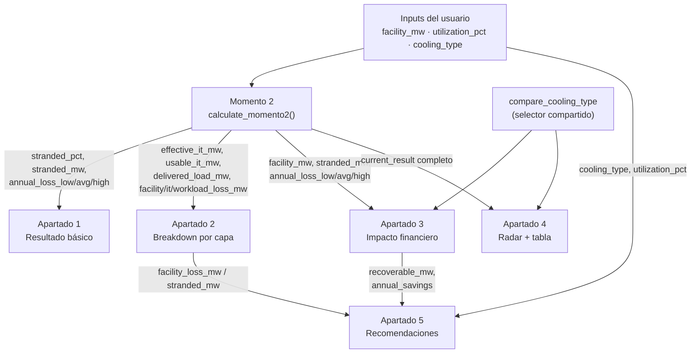

# PhysaFlow — Pseudocódigo del Sistema (Input/Output)

Documento de acompañamiento para la documentación de componentes en Figma. Describe, momento
por momento y apartado por apartado, qué recibe y qué devuelve cada parte del cálculo.

---

## Inputs y constantes del sistema

```
// ===== INPUTS (los 3 que ingresa el usuario) =====
INPUT facility_mw       // número, MW del facility
INPUT utilization_pct   // número, 0-100
INPUT cooling_type      // enum: AIR | HYBRID | LIQUID | IMMERSION

// ===== CONSTANTES DEL MODELO (fijas, no dependen del input) =====
CONST REDUNDANCY_MARGIN = 0.15        // 15%, margen N+1 estándar
CONST HOURS_PER_YEAR = 8760

CONST ELECTRICITY_PRICE_LOW  = 60     // USD/MWh
CONST ELECTRICITY_PRICE_AVG  = 83     // USD/MWh
CONST ELECTRICITY_PRICE_HIGH = 110    // USD/MWh

// ===== TABLA DE REFERENCIA POR COOLING TYPE =====
TABLE COOLING_SPECS:
  AIR:       { pue_low: 1.40, pue_high: 1.60, pue_mid: 1.50, density_low: 10,  density_high: 20  }
  HYBRID:    { pue_low: 1.20, pue_high: 1.40, pue_mid: 1.30, density_low: 20,  density_high: 40  }
  LIQUID:    { pue_low: 1.05, pue_high: 1.20, pue_mid: 1.125, density_low: 40,  density_high: 80  }
  IMMERSION: { pue_low: 1.02, pue_high: 1.10, pue_mid: 1.06, density_low: 100, density_high: 200 }
```

---

## MOMENTO 2 — Resultado básico

```
FUNCTION calculate_momento2(facility_mw, utilization_pct, cooling_type):

  pue = COOLING_SPECS[cooling_type].pue_mid

  // ---- Capa Facility: pérdida por overhead de cooling ----
  effective_it_mw = facility_mw / pue
  facility_loss_mw = facility_mw - effective_it_mw

  // ---- Capa IT: pérdida por margen de redundancia ----
  usable_it_mw = effective_it_mw * (1 - REDUNDANCY_MARGIN)
  it_loss_mw = effective_it_mw - usable_it_mw

  // ---- Capa Workload: pérdida por subutilización ----
  delivered_load_mw = usable_it_mw * (utilization_pct / 100)
  workload_loss_mw = usable_it_mw - delivered_load_mw

  // ---- OUTPUT 1: Stranded Capacity ----
  stranded_mw = facility_loss_mw + it_loss_mw + workload_loss_mw
              // == facility_mw - delivered_load_mw
  stranded_pct = (stranded_mw / facility_mw) * 100

  // ---- OUTPUT 2: Pérdida financiera anual (rango) ----
  annual_energy_wasted_mwh = stranded_mw * HOURS_PER_YEAR

  annual_loss_low  = annual_energy_wasted_mwh * ELECTRICITY_PRICE_LOW
  annual_loss_avg  = annual_energy_wasted_mwh * ELECTRICITY_PRICE_AVG
  annual_loss_high = annual_energy_wasted_mwh * ELECTRICITY_PRICE_HIGH

  RETURN {
    stranded_mw, stranded_pct,
    annual_loss_low, annual_loss_avg, annual_loss_high,
    delivered_load_mw, effective_it_mw, usable_it_mw   // se reusan en Momento 3
  }
```

```
// ===== INPUT de Momento 2 =====
IN:  facility_mw, utilization_pct, cooling_type

// ===== OUTPUT de Momento 2 (lo que se muestra) =====
OUT: stranded_pct              → gauge/donut (%)
OUT: stranded_mw               → barra de 2 segmentos (usado vs. stranded)
OUT: annual_loss_low/avg/high  → rango de pérdida financiera
```

---

## MOMENTO 3

### Apartado 1 — Resultado básico (detalle)

No agrega cálculos nuevos — reusa el output de Momento 2 y le suma texto/contexto derivado.

```
FUNCTION apartado1_resultado_basico(momento2_result, cooling_type):

  // ---- Texto de severidad (3 niveles, según stranded_pct) ----
  IF stranded_pct >= 60:
      severity_text = "Estás perdiendo más de la mitad de tu capacidad instalada."
  ELSE IF stranded_pct >= 35:
      severity_text = "Hay una porción considerable de tu capacidad sin aprovechar."
  ELSE:
      severity_text = "Tu operación está relativamente eficiente, aunque queda margen."

  // ---- Contexto de densidad (2 variantes, según cooling_type) ----
  IF cooling_type == LIQUID OR cooling_type == IMMERSION:
      density_text = "high_density"   // asume carga de IA, 50-120+ kW/rack esperable
  ELSE:
      density_text = "traditional"    // texto neutro, tradicional 5-15 kW/rack

  RETURN {
    severity_text,
    density_text,
    pue_range: COOLING_SPECS[cooling_type].pue_low..pue_high   // barra de rango fija
  }
```

```
// ===== INPUT del Apartado 1 =====
IN:  momento2_result (stranded_pct, stranded_mw, delivered_load_mw)
IN:  cooling_type

// ===== OUTPUT del Apartado 1 =====
OUT: severity_text        → frase corta + párrafo con los números
OUT: pue_range            → barra de rango (solo el cooling_type actual)
OUT: density_text         → 1 de 2 variantes de contexto
```

**Nota:** el texto de este apartado (severidad general) es intencionalmente distinto al de la
Columna 1 de Recomendaciones (Apartado 5) — ese cita el % específico del breakdown por capa, no
repite la severidad general con otras palabras.

---

### Apartado 2 — Breakdown por capa

```
FUNCTION apartado2_breakdown_por_capa(facility_mw, utilization_pct, pue,
                                       effective_it_mw, usable_it_mw, delivered_load_mw,
                                       facility_loss_mw, it_loss_mw, workload_loss_mw):

  // ---- Por cada capa: cuánto pasa, cuánto se pierde ACÁ, cuánto ya se había perdido ANTES ----

  LAYER facility:
    value_mw      = facility_mw
    output_mw     = effective_it_mw
    lost_here_mw  = facility_loss_mw
    lost_before_mw = 0
    local_pass_pct = 1 / pue                      // = "Esta capa: 100% → X%"

  LAYER it:
    value_mw      = effective_it_mw
    output_mw     = usable_it_mw
    lost_here_mw  = it_loss_mw
    lost_before_mw = facility_loss_mw
    local_pass_pct = 1 - REDUNDANCY_MARGIN         // = 85%, fijo

  LAYER workload:
    value_mw      = delivered_load_mw
    output_mw     = delivered_load_mw
    lost_here_mw  = workload_loss_mw
    lost_before_mw = facility_loss_mw + it_loss_mw
    local_pass_pct = utilization_pct / 100         // = tu input, literal

  // ---- Por cada capa, para la barra de 3 colores (todo como % del nameplate) ----
  FOR EACH layer:
    delivered_pct    = (layer.output_mw / facility_mw) * 100      // verde
    lost_here_pct     = (layer.lost_here_mw / facility_mw) * 100   // dorado
    lost_before_pct   = (layer.lost_before_mw / facility_mw) * 100 // gris
    cumulative_before_pct = 100 - lost_before_pct
    cumulative_after_pct  = delivered_pct

  RETURN { facility_layer, it_layer, workload_layer }
```

```
// ===== INPUT del Apartado 2 =====
IN:  facility_mw, utilization_pct, pue
IN:  effective_it_mw, usable_it_mw, delivered_load_mw     (de Momento 2)
IN:  facility_loss_mw, it_loss_mw, workload_loss_mw        (de Momento 2)

// ===== OUTPUT del Apartado 2 (por cada una de las 3 capas) =====
OUT: value_mw            → número grande de la card
OUT: delivered_pct / lost_here_pct / lost_before_pct   → los 3 segmentos de la barra
OUT: cumulative_before_pct → cumulative_after_pct       → "100% → 62.5% del nameplate"
OUT: local_pass_pct      → "Esta capa: 100% → X%"  (coincide con 1/pue, redundancia, o utilización)
```

**Nota clave** para el texto de respaldo ("Cómo se calcula"): `local_pass_pct` de cada capa **es
literalmente** un parámetro del modelo, no un cálculo aparte — Facility = `1/pue`, IT =
`1 - REDUNDANCY_MARGIN` (constante, no cambia), Workload = `utilization_pct/100` (el input tal
cual).

**Contenido fijo de este apartado** (no se calcula, es contexto de industria siempre igual):
donut concéntrico tradicional (IT 70% / Cooling 20% / Electrical 7% / Misc 3%) vs. data center
de IA (IT 45% / Infraestructura 55%), con nota de que la capa Workload se mide con ITWC (The
Green Grid).

---

### Apartado 3 — Impacto financiero

```
FUNCTION apartado3_impacto_financiero(facility_mw, stranded_mw,
                                       annual_loss_low, annual_loss_avg, annual_loss_high,
                                       compare_cooling_type, current_result):

  // ---- Costo total del facility (a precio promedio) ----
  total_facility_cost_avg = facility_mw * HOURS_PER_YEAR * ELECTRICITY_PRICE_AVG

  // ---- El rango de pérdida ya viene calculado de Momento 2 ----
  // annual_loss_low / annual_loss_avg / annual_loss_high

  // ---- Ahorro proyectado: necesita el escenario alternativo seleccionado ----
  compare_result = calculate_momento2(facility_mw, utilization_pct, compare_cooling_type)

  recoverable_mw   = current_result.stranded_mw - compare_result.stranded_mw
  annual_savings   = recoverable_mw * HOURS_PER_YEAR * ELECTRICITY_PRICE_AVG

  projected_3y  = annual_savings * 3
  projected_5y  = annual_savings * 5
  projected_10y = annual_savings * 10

  RETURN {
    total_facility_cost_avg,
    annual_loss_low, annual_loss_avg, annual_loss_high,
    recoverable_mw, annual_savings,
    projected_3y, projected_5y, projected_10y
  }
```

```
// ===== INPUT del Apartado 3 =====
IN:  facility_mw, stranded_mw                          (de Momento 2)
IN:  annual_loss_low / avg / high                       (de Momento 2)
IN:  compare_cooling_type                                (seleccionado por el usuario — estado
                                                           compartido con Apartado 4)

// ===== OUTPUT del Apartado 3 =====
OUT: total_facility_cost_avg   → "Costo total del facility"
OUT: annual_loss_low/avg/high  → barra de rango (min-prom-max)
OUT: recoverable_mw            → usado también en Apartado 4
OUT: annual_savings            → base del proyectado
OUT: projected_3y/5y/10y       → 3 números grandes
```

**Nota:** la tabla de precios por región (PPA solar ~$60, eólica ~$75, Texas ~$80, etc.) es
**fija, no se calcula** — va directo como contenido de referencia, no como parte de esta función.

---

### Apartado 4 — Radar + tabla comparativa

```
FUNCTION apartado4_radar_y_tabla(current_result, compare_cooling_type, facility_mw, utilization_pct):

  compare_result = calculate_momento2(facility_mw, utilization_pct, compare_cooling_type)

  // ---- Los 4 ejes del radar, cada uno normalizado 0-100 con ESCALA FIJA ----
  // (fija = no depende de contra qué se compara, para que el actual no siempre caiga en 0)

  FUNCTION radar_scores(result, cooling_type):
    pue = COOLING_SPECS[cooling_type].pue_mid
    density_mid = (COOLING_SPECS[cooling_type].density_low + COOLING_SPECS[cooling_type].density_high) / 2

    eje_uso_eficiente = 100 - result.stranded_pct

    eje_pue = 100 * (2.0 - pue) / 1.0            // escala fija: PUE 1.0=100 … 2.0=0

    eje_perdida_anual = 100 * (1 - result.annual_loss_avg / 3_000_000)   // escala fija, techo en 3M USD

    eje_densidad = 100 * (density_mid / 200)      // escala fija, techo en 200 kW/rack

    RETURN [eje_uso_eficiente, eje_pue, eje_perdida_anual, eje_densidad]

  current_scores = radar_scores(current_result, current_cooling_type)
  compare_scores = radar_scores(compare_result, compare_cooling_type)

  // ---- Stats destacados (fuera del radar) ----
  recoverable_mw     = current_result.stranded_mw - compare_result.stranded_mw
  relative_savings_pct = (current_result.annual_loss_avg - compare_result.annual_loss_avg)
                          / current_result.annual_loss_avg * 100

  // ---- Tabla: mismas 4 filas que los ejes, en valores reales (no normalizados) ----
  TABLE valores_directos:
    ROW "Uso eficiente":     actual = 100 - current.stranded_pct    | comparado = 100 - compare.stranded_pct
    ROW "PUE":                actual = pue_range(current_cooling)    | comparado = pue_range(compare_cooling)
    ROW "Pérdida anual":      actual = current.annual_loss_avg       | comparado = compare.annual_loss_avg
    ROW "Densidad soportada": actual = density_range(current_cooling)| comparado = density_range(compare_cooling)

  RETURN { current_scores, compare_scores, recoverable_mw, relative_savings_pct, valores_directos }
```

```
// ===== INPUT del Apartado 4 =====
IN:  current_result                    (de Momento 2, escenario actual)
IN:  compare_cooling_type              (mismo selector compartido del Apartado 3)
IN:  facility_mw, utilization_pct

// ===== OUTPUT del Apartado 4 =====
OUT: current_scores[4] / compare_scores[4]  → las 2 series del radar
OUT: recoverable_mw            → stat destacado (mismo valor que en Apartado 3)
OUT: relative_savings_pct      → stat destacado
OUT: valores_directos          → tabla de 4 filas, unificada con los ejes del radar
```

**Nota:** el "Pérdida anual" del radar está en escala fija (no relativa al par comparado) a
propósito — así el escenario actual no cae siempre en 0 en ese eje, y las 4 alternativas se
pueden posicionar de forma consistente sin importar cuál se esté mirando.

---

### Apartado 5 — Recomendaciones (3 columnas)

```
FUNCTION apartado5_recomendaciones(current_result, cooling_type, utilization_pct,
                                    compare_cooling_type, recoverable_mw, annual_savings):

  // ---- Columna 1: Cooling Overhead — dispara según % del breakdown en capa Facility ----
  facility_ratio = current_result.facility_loss_mw / current_result.stranded_mw
  facility_pct   = facility_ratio * 100

  IF facility_ratio >= 0.45:
      col1_text = "alto"      // Facility concentra la mayor parte de la pérdida
  ELSE IF facility_ratio >= 0.25:
      col1_text = "moderado"  // porción moderada
  ELSE:
      col1_text = "bajo"      // Facility no es el problema principal

  // ---- Columna 2: Tecnología / Densidad — dispara según cooling_type actual ----
  IF cooling_type == AIR OR cooling_type == HYBRID:
      col2_text = "oportunidad_eficiencia"   // usa recoverable_mw y annual_savings vs. compare_cooling_type
  ELSE IF cooling_type == LIQUID:
      col2_text = "margen_chico"             // ya alta densidad, Immersion suma poco
  ELSE:  // IMMERSION
      col2_text = "tope_tecnologico"         // cooling ya no es la palanca, mirar utilización

  // ---- Columna 3: Utilización — dispara según el input directo ----
  IF utilization_pct < 50:
      col3_text = "mucha_capacidad_ociosa"   // palanca operativa, más barata
  ELSE IF utilization_pct <= 80:
      col3_text = "margen_operativo"
  ELSE:
      col3_text = "limite_infraestructura"   // ya no es operativo, es de infraestructura

  RETURN { col1_text, facility_pct, col2_text, col3_text }
```

```
// ===== INPUT del Apartado 5 =====
IN:  current_result.facility_loss_mw / stranded_mw   (de Momento 2/Apartado 2)
IN:  cooling_type                                     (input original del usuario)
IN:  utilization_pct                                  (input original del usuario)
IN:  compare_cooling_type, recoverable_mw, annual_savings   (de Apartado 3/4, mismo selector)

// ===== OUTPUT del Apartado 5 =====
OUT: columna 1 → 1 de 3 variantes de texto, con facility_pct insertado
OUT: columna 2 → 1 de 3 variantes de texto, con recoverable_mw/annual_savings insertados (solo si aplica)
OUT: columna 3 → 1 de 3 variantes de texto, con utilization_pct insertado
```

---

## Cómo se encadenan las funciones



**Puntos importantes que muestra el diagrama:**

- **Todo nace de Momento 2** — ningún apartado de Momento 3 recalcula stranded_mw o la pérdida
  financiera desde cero, todos reusan ese resultado.
- **El selector de comparación (`compare_cooling_type`) es un solo estado**, compartido entre el
  Apartado 3 y el Apartado 4 — no son dos selectores independientes.
- **El Apartado 5 es el que más fuentes combina**: toma datos del Apartado 2 (breakdown), del
  Apartado 3/4 (selector + ahorro), y de los inputs originales (cooling_type, utilization_pct)
  directamente.
- **Los Apartados 1, 2 y 3 no dependen del selector de comparación** — solo el 4 y el 5 (columna 2)
  lo usan.

---

*Documento de acompañamiento — equipo No Country, desafío PhysaFlow / Stranded Capacity Calculator.*
